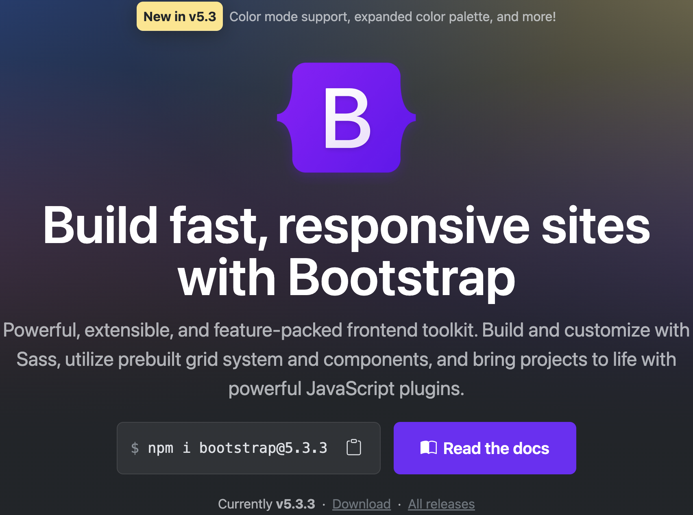

# Practica #2 Con Boostrap
## Por: Valencia Hernández Carlos Eduardo

Esta practica se realizo empleando boostrap, un archivo de estilos, y html.
Elementos como el navbar, badge, flex, caruosuel, lista etc, feuron usados de Boostrap, asi como los iconos.

### Descarga esta rama para obtener mis archivos: Code > Download.zip o Da click en este enlace:
[Descargar esta rama](https://github.com/choterifa/Tareas-Topicos/archive/refs/heads/Practica_2_Bootstrap.zip)
 

